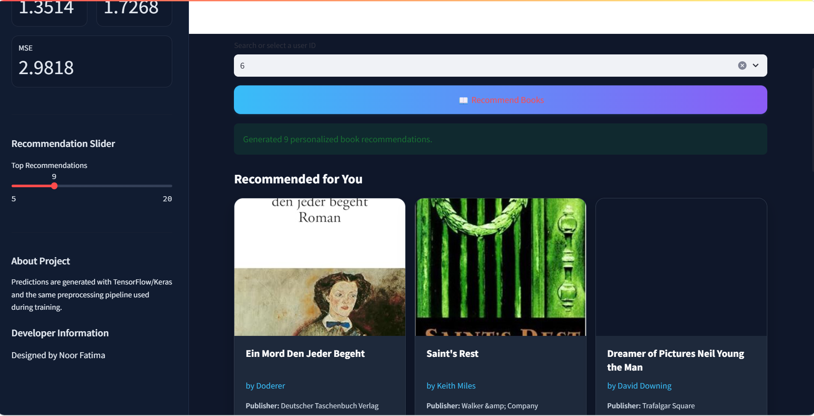

📚 Deep Learning Book Recommendation System using Feedforward Neural Network (FNN)
Project Overview
An AI-powered book recommendation system built with a Feedforward Neural Network (FNN). The application predicts user ratings for unread books and recommends the highest-scoring titles through a modern Streamlit interface.
The project uses the Book-Crossing Dataset, TensorFlow/Keras for deep learning, and Scikit-learn preprocessing tools.
✨ Features
Personalized book recommendations
Feedforward Neural Network–based rating prediction
Book, user, and ratings dataset integration
Data cleaning, EDA, feature encoding, and feature scaling
Saved Keras model and preprocessing artifacts
Streamlit-based interactive web interface
Book metadata and cover image display
Safe handling of unseen categorical values
🛠️ Technologies Used
Category	Technologies
Language	Python
Deep Learning	TensorFlow, Keras
Model	Feedforward Neural Network (FNN)
Data Processing	Pandas, NumPy
Machine Learning	Scikit-learn
Deployment	Streamlit
Model Artifacts	Joblib

📊 Dataset
This project uses the Book-Crossing Dataset.
File	Description
Books.csv	Book metadata, including ISBN, title, author, publisher, and image URLs
Users.csv	User details such as user ID, location, and age
Ratings.csv	User ratings assigned to books

🧠 Model Architecture
The recommendation engine uses a Feedforward Neural Network for regression-based rating prediction.
Layer	Configuration
Input Layer	Encoded and scaled book/user features
Hidden Layer 1	Dense (128 units, ReLU)
Dropout	0.30
Hidden Layer 2	Dense (64 units, ReLU)
Dropout	0.25
Hidden Layer 3	Dense (32 units, ReLU)
Dropout	0.20
Output Layer	Dense (1 unit, Linear activation)

The model predicts a rating on a scale of 0–10.

🔄 Project Workflow
Import Libraries  
Load Dataset  
Exploratory Data Analysis (EDA)  
Data Cleaning  
Feature Engineering & Encoding  
Train-Test Split  
Build Feedforward Neural Network  
Train the Model  
Evaluate the Model  
Save Model (.keras)  
Save Encoders and Scaler (.pkl)  
Deploy using Streamlit

📁 Folder Structure
deep-learning-book-recommendation-system/
│
├── app.py
├── backend.py
├── requirements.txt
├── README.md
│
├── Books.csv
├── Users.csv
├── Ratings.csv
│
├── book_recommender.keras
├── feature_encoders.pkl
├── feature_scaler.pkl
└── feature_columns.pkl

⚙️ Installation
Clone the repository:
git clone <your-repository-url>
cd deep-learning-book-recommendation-system
Create a virtual environment:
python -m venv .venv
Activate the virtual environment:
# Windows
.venv\Scripts\activate

# macOS / Linux
source .venv/bin/activate
Install dependencies:
pip install -r requirements.txt
Run the Streamlit application:
streamlit run app.py

📸 Screenshots
Application Home Page
](image.png)
Recommendation Results
](image-2.png)

👩‍💻 Author
Noor Fatima
GitHub: [https://github.com/Nooreyy](https://github.com/Nooreyy)
LinkedIn: [https://www.linkedin.com/in/noodex00/](https://www.linkedin.com/in/noodex00/)